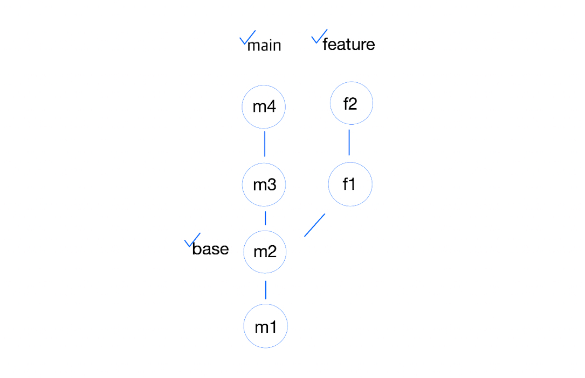

# git 명령어 응용

### 3-way merge

**일반적인 병합 방식 (자동으로 처리)**

- 병합할 두 브랜치와 공통 조상 커밋을 이용하여 병합하는 방식
    - Merge 전
    
    
    
    - Merge 후


```markdown
git merge

- 현재 브랜치와 병합 대상의 관계가 fast-forward 관계 여부와 관계없이 merge 커밋을 생성하여 병합
git merge --no-ff
```

---

### fast-forward merge (빨리감기 병합)

새로운 브랜치를 만들고 해당 브랜치에서 변경사항을 커밋 후 메인 브랜치에 그대로 적용하는 병합 방법

**메인 브랜치가 새로운 커밋을 추가하지 않은 경우에만 가능**

- Merge 전


- Merge 후
    
    
    

- fast-forward는 커밋 히스토리를 깔끔하게 유지할 수 있음
- 기존의 커밋 히스토리가 사라질 수 있어 유의해야 함 (과거의 기록을 볼 수가 ❌)

```markdown
- 현재 브랜치와 병합할 브랜치가 fast-forward일 경우 fast-forward 병합을 진행
- 그렇지 않은 경우 3-way-merge를 진행하여 merge 커밋을 생성하여 병합
git merge

- git merge -ff <브랜치명>
git merge --ff feature

- 현재 브랜치와 병합할 브랜치가 ff 관계인 경우에만 병합을 진행하고, 그렇지 않은 경우에는 병합 ❌
git merge --ff-only feature
```

---

### squash and merge

새 브랜치의 커밋기록을 으깨서 메인 브랜치에 하나로 넣음

- Merge 전


- Merge 후


```markdown
- 병합 대상 브랜치의 모든 커밋을 하나의 커밋으로 압축하여 현재 브랜치로 가져옴
- 이때 merge 커밋 없이 실제 작업이 이루어지는 따로의 커밋은 존재 ❌

- git merge --squash <브랜치명>
git merge --squash feature
```
---

### rebase & merge (rebase : base를 재설정)

3-way로만 merge를 하면 브랜치 줄이 다양해짐

그래서 간단한 브랜치들은 rebase를 진행

- merge 전


- merge 후
    
    
    

rebase는 fast forward와 달리 main 브랜치에 커밋이 있어도 merge가 가능하다는 장점이 있음

**but 이어붙이는 것이기 때문에 conflict 발생 가능함 (단점)**

rebase 명령어는 새로 생성한 브랜치에 명령하는 것이고, merge 명령어는 기존 브랜치(통합하려고 하는)에서 명령하는 것

📌 상황에 맞는 명령어를 사용해야 함

```markdown
git checkout "새로운 브랜치"
git rebase "브랜치명"

git checkout "브랜치명"
git merge "새로운 브랜치"
```

---

## git 명령어 학습

### git restore (복구)

- 작업 디렉토리의 파일 상태를 복구할 때 사용하는 명령어 (commit 하지 않은 변경사항을 마지막 상태로 되돌림)

```markdown
git restore 파일명

# 특정 시점으로 해당 파일을 복구
git restore --source <commit id> <파일명>

# 스테이지 취소
git restore --staged <파일명>
```

### git revert (되돌아감)

- 되돌아가는데 되돌아간다는 기록이 남아있음

```markdown
# 지정한 commit에서 변경된 내용을 되돌림. 이를 통해 이전 커밋으로 되돌아갈 수 있음
git revert <커밋id>

# 여러 개의 커밋에서 변경된 내용을 모두 되돌림
git revert <commit id 1> <commit id 2>

# 직전의 커밋 변경 내용을 되돌림
git revert HEAD

# Merge 커밋을 취소
git revert HEAD
```

---

## 알아두면 좋은 정보

### .gitignore 파일

- .gitignore 파일은 git으로 버전 관리를 하지 않을 파일이나 디렉토리를 지정하는 파일
- .gitignore 파일에 지정된 파일이나 디렉토리는 git으로 관리되지 ❌

> 언어, ide, 프로젝트마다 관리하면 안되는 파일들이 다름
그렇기에 구글에 내 상황을 적어서 검색하는 것이 제일 좋음
> 

<aside>
⭐

현재 상황

언어 : js

ide : vscode

→ ‘javascript vscode .gitignore file example’로 검색

</aside>

<aside>
⭐

유저가 업로드한 ‘프로필 이미지’나 ‘영상’들은 개발자가 생성한 코드가 아니기에 git으로 관리하지 ❌
그럴 경우 아래와 같이 예외처리를 하기도 함

</aside>

```markdown
# JPEG
*.jpg
*.jpeg
*.jpe
*.jif
*.jfif
*.jfi
```

### 커밋 메시지 작성

> 명확하고 간결하게 작성
제목과 본문은 분리
제목은 50자로 제한, 본문은 개조식 (단어, 요점별로 짧게 정리)으로 작성하여 명확성 🆙
> 

**예시**

```html
[closed #1] 게시글 목록 조회 오류 수정 or [JIRA-123] 게시글 목록 조회 오류 수정

- 인덱스 범위 오류 수정
- 리스트 접근 조건문 추가하여 안전하게 접근하도록 변경
- 사용자 테스트 중 보고된 ~~ 문제 해결을 위해 수정
```

### origin, upstream

- git에서 코드의 흐름과 관계를 나타내는 중요한 개념
- git 저장소 (repository)에서 다른 저장소로 코드를 복사해오는 과정 → fork
- 이후 복사된 코드를 개인 컴퓨터(로컬)에서 수정하는 작업을 진행
    
    
    

위 예시에서 upstream과 origin의 위치는 기준점에 따라 달라짐

- 기준점이 로컬 → origin = **로컬 환경에서 작업 중인 저장소를 가리키는 원격 저장소**
    - 보통 origin = 본인이 작업하고 있는 프로젝트의 github 저장소
- upstream = **origin이 fork된 원본 저장소**
    - 본래의 코드가 존재하는 원격 저장소

### git 브랜치 전략 (git-flow)

> 전략은 하나의 접근 방식에 불과하며, 모든 상황에서 정답이 되지 ❌
기본적으로 모든 배포는 별도의 격리된 브랜치에서 작업을 완료한 후, PR을 통해 배포를 위한 브랜치에 merge 해야 함
> 

***브랜치의 구분***

1. Master / Main : 배포 브랜치
    - 안정성이 보장되며, 운영 중 발생할 수 있는 치명적인 문제에 대비해 롤백할 수 있는 커밋 집합을 유지 (주니어는 보통 권한 ❌)
2. Develop (Staging) : 테스트 브랜치
    - 로컬에서의 테스트와 개발을 마친 후 최종적인 테스트가 이루어지는 브랜치
    - 별도의 Staging Zone 용 브랜치를 만드는 것은 가능하지만, 과도할 수도..?
3. Feature : 개발 브랜치 - Develop 브랜치를 기점으로 새 브랜치를 만들어 개발
    1. feature/jira-001 : 기획과 디자인에 따라 개발자에게 발행된 티켓으로 브랜치 명을 정함
    2. feature/login-with-session : 어떤 작업인 지 바로 알 수 있도록 기능 내용에 대한 요약을 브랜치 명으로 정함
    3. hyuunminn/login-with-session : 브랜치 명에 개발자 명을 붙여넣음
        - 로컬에서 개발을 완료한 경우 Develop 브랜치에 PR 요청을 하여 마지막 테스트를 준비함
            - PR 요청을 통해 로컬에서 완료한 개발 코드를 개발자들에게 최초 노출하여 코드 리뷰를 받을 수 있음
            - PR 요청을 통해 Github workflow로 CI 파이프라인을 연결했다면, 코드 유효성 테스트 가능